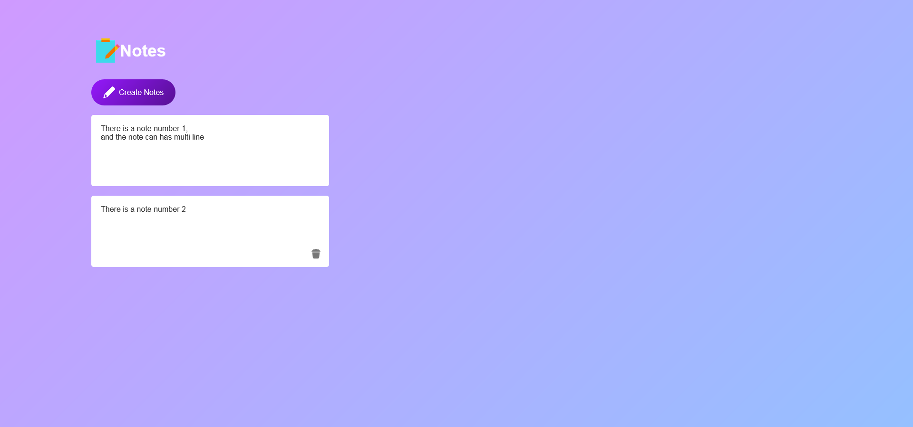

# Notes App

A simple note-taking application built using HTML5, CSS3, and JavaScript. The app allows users to create, edit, and delete notes. All notes are stored locally using the browser's `localStorage` so that they remain accessible even after refreshing the page.

## Features

- Create new notes with a simple click.
- Edit existing notes directly in the browser.
- Delete notes when no longer needed.
- Notes are automatically saved to `localStorage` and persist across browser sessions.

## Demo



## How to Use

1. **Create a Note**: Click on the "Create Notes" button to add a new note.
2. **Edit a Note**: Click on the note content to edit it. Changes are saved automatically as you type.
3. **Delete a Note**: Click the delete icon (🗑️) at the bottom of each note to remove it.

## Technologies Used

- **HTML5**: For the structure and layout of the app.
- **CSS3**: For styling the application and adding responsiveness.
- **JavaScript**: For handling the logic, user interactions, and saving notes in `localStorage`.

## Project Structure

```bash
├── index.html          # Main HTML file
├── style.css           # Stylesheet for the app
├── script.js           # JavaScript file containing the app logic
├── images              # Folder containing icons and logo
│   ├── logo.png        # Logo for the app
│   ├── delete.png      # Icon for deleting notes
│   └── edit.png        # Icon for creating notes
└── README.md           # Documentation
